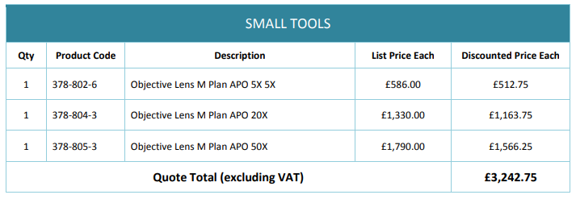

## Cost of parts to be bought on the grant

I figured out that I could use my Canon-MP-E lens for x1 to x3 magnifications, which freed up some budget to buy a 50x objective instead of a 2x. 

I also figured out that I could set up video editing equipment using my own 10 year old laptop and my old copy of Adobe Premiere Pro CS3. It is not fast, but it does the job.

This left funds for the following, which have been purchased:

Total cost incl VAT:
£3891.3
