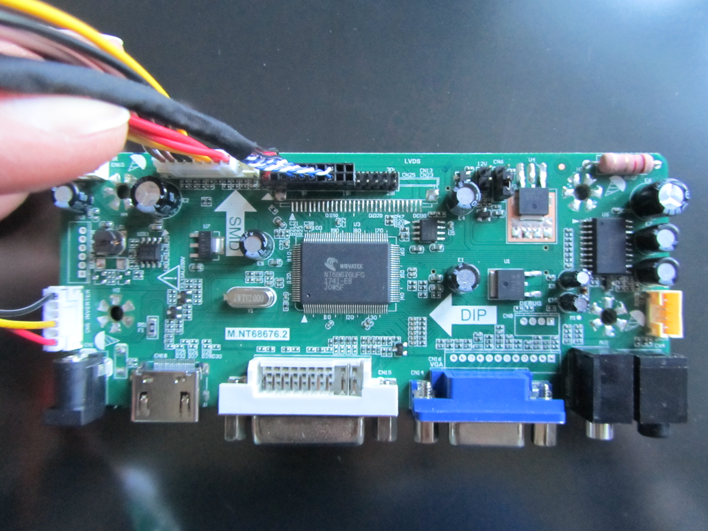
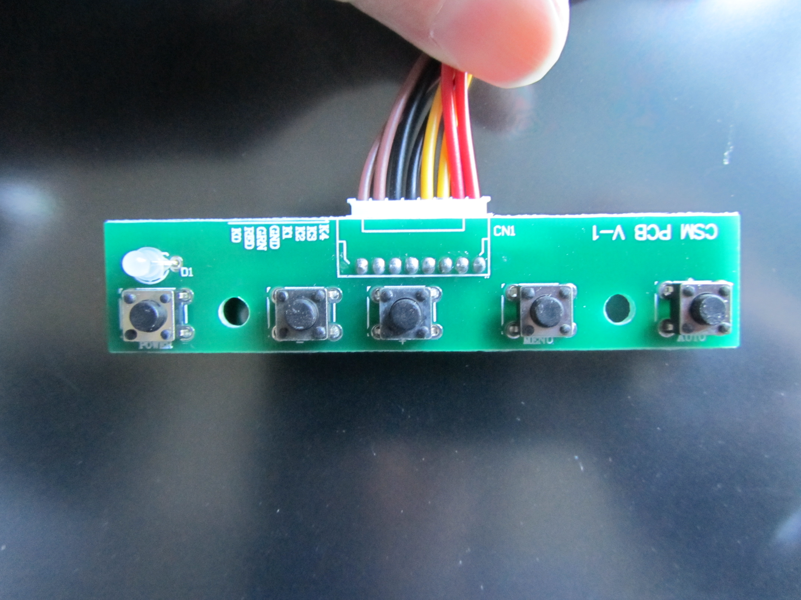
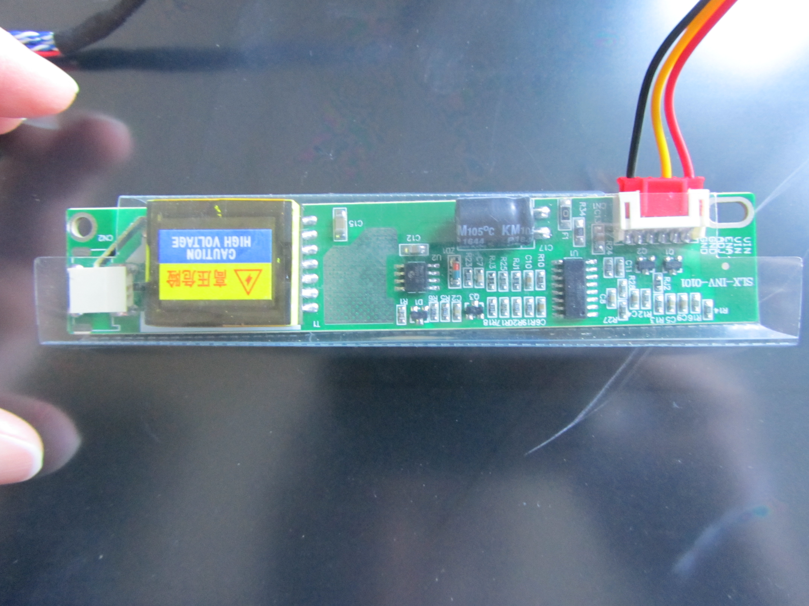
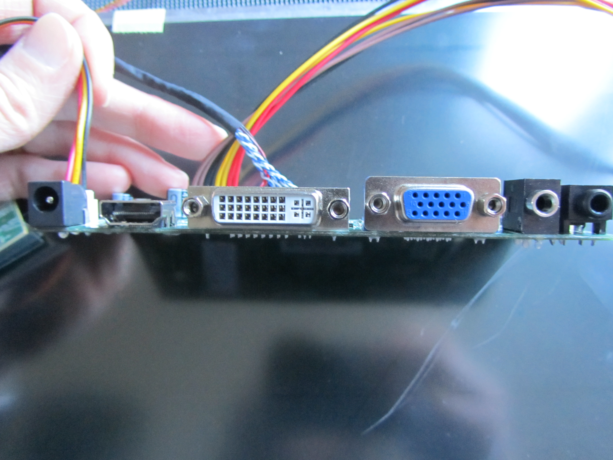
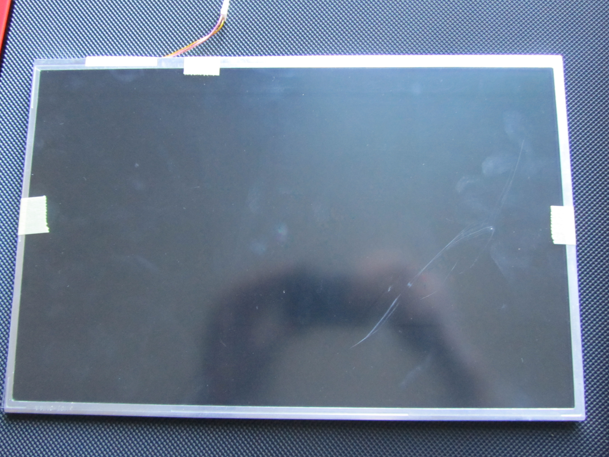
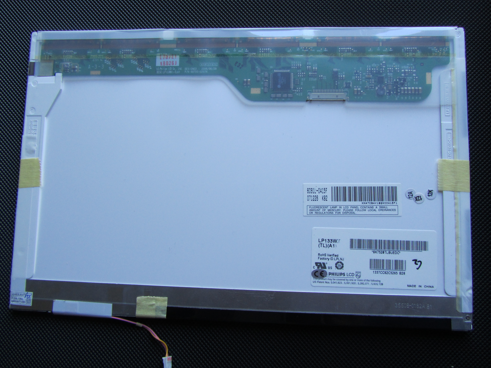
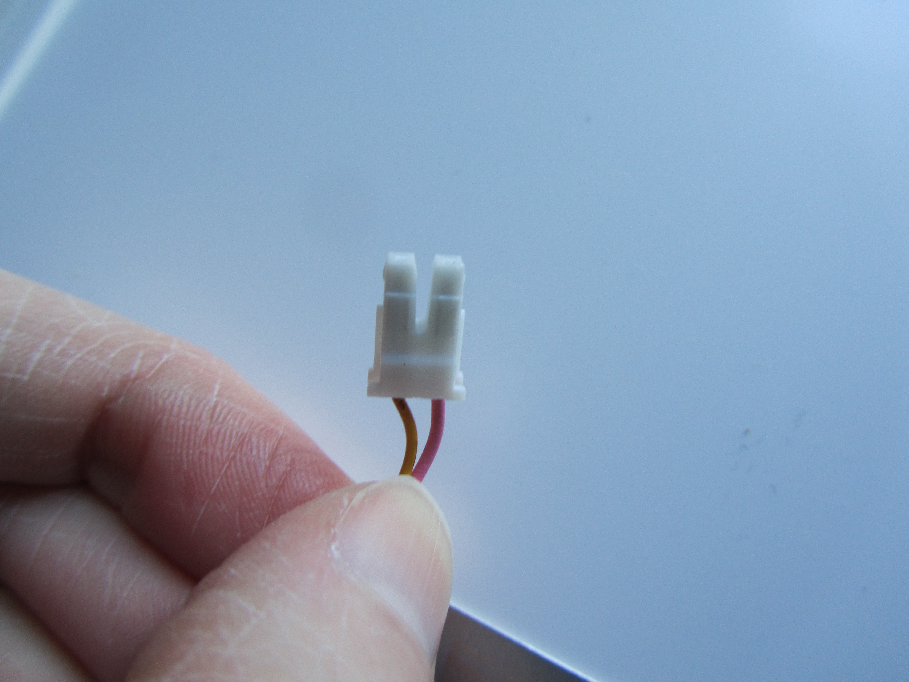
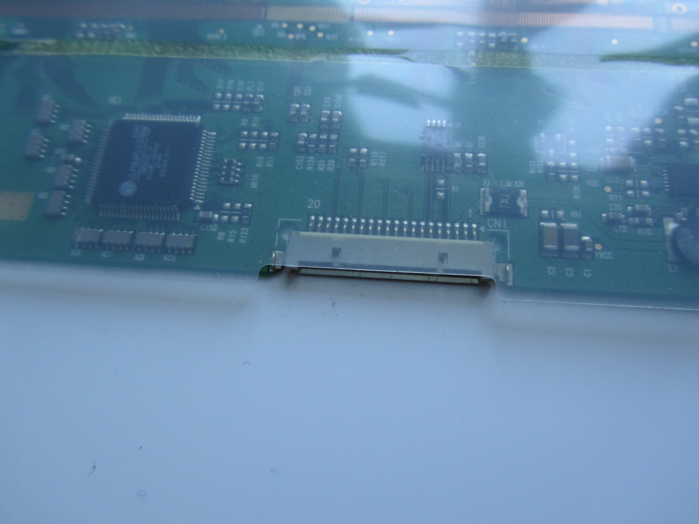
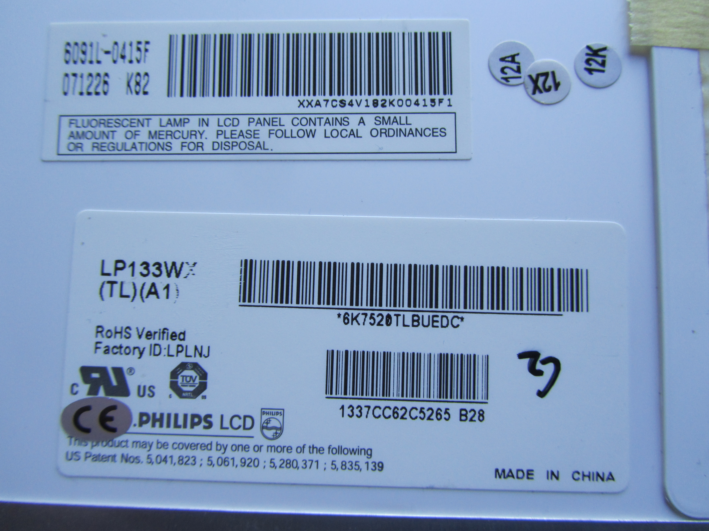

Since my Toshiba laptop screen works so well, one of my ideas is to build a free standing desktop screen using a replacement screen of the same type bought from ebay. I have bought the parts below and am just getting ready to build the screen. 

I bought the screen controller on ebay from e-qstore. The plan comes from this <a href="http://www.instructables.com/id/How-to-Convert-a-Laptop-LCD-into-an-External-Monit/> Instructable</a>. The screen type is called B133EW01 V.3.

