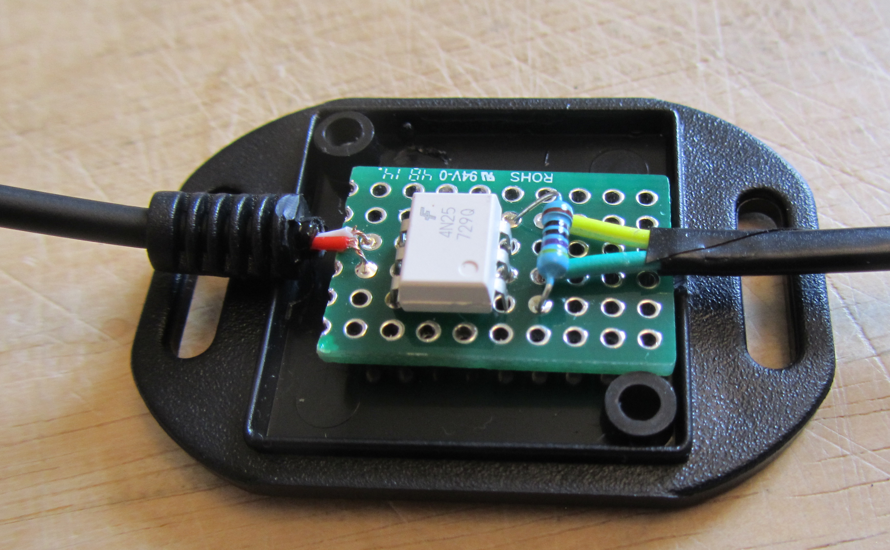

# Camera trigger

In our previous work we triggered the camera using an <a href="https://github.com/BioMakers/23_Focus-stacking-system-for-gametophyte-ferns/blob/master/ArduinoMethod.md">infra red remote control</a>. In this new project we have converted to an  electrical shutter release wire, fired by the arduino via an audio jack. 

The main gain from this conversion is that we will then be able to use mirror lock-up to reduce vibration. This is not possible using the infra red remote control. We will also avoid losing occasional shutter releases when the sunshine in the room is so bright that the infra red signal get lost in the intensity of the sunshine. This has been an issue in summer before. 

The design was copied from <a href="http://www.martyncurrey.com/activating-the-shutter-release/">Martyn Curry's system</a>.

We did not alter the code on the arduino, as the commands that fired the shutter using the infra red remote control work that same way in triggering this system.

The parts and their prices are shown below:

 - 4N25M optocoupler £2.20 (for 5)
 - circuit board     £1.94
 - plastic box       £1.96
 - 470 ohm resistor (from bits box)
 - cable            £ 3.42 
Total:               £9.52

Here is the wiring diagram: 

  

Here is the arrangement of the coloured wires inside the cable that goes to the camera. The colours are the colours of the wires inside the camera cable. The central column shows what the effect is on the camera of sending a signal down that wire. The third column shows which pin the wire is connected to on the 4N25M optocoupler. 

  

Below are some photos of the work in progress:

This is the plate that we used to fix the electronic components down: 
  
This is the camera plug: 
  
This is some wires, ready to be added to the system.  
 

This shows the wires ready to be soldered to the board: 
  
This is the plate with the wires and components in place.  
  
This is the camera plug going into the camera: 
  
This shows the conversion of the colours of wires in the arduino to the colours of wires going to the board. We need to note these to be able to wire the system again if the wires come undone.   
 

This shows the old wires from the infra red trigger now being used for the wired trigger: 
  

