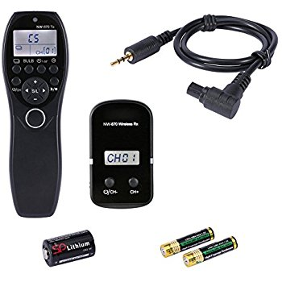
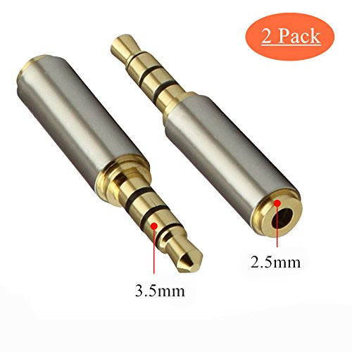
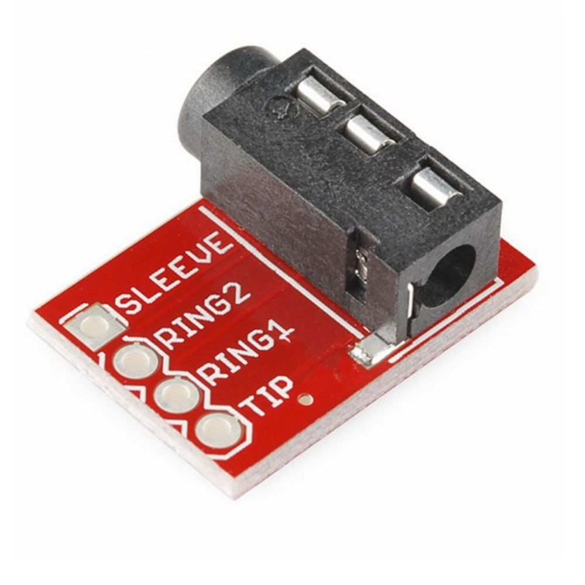

# Camera trigger

In out previous work we triggered the camera using an infra red remote control. In this new project we are planning to convert to an electrical shutter release wire, fired by the arduino via an audio jack. 

The main gain from this conversion is that we will then be able to use mirror lock-up to reduce vibration. This is not possible using the infra red remote control. 

Here are the parts that we will use to build the new system:

1) We are using the cable from this electronic camera shutter release. The set is called a "Andoer 2.4G Wireless Remote Control LCD Timer Shutter Release 32 Channels for Canon 7D"

2) The shutter release cable has a 2.5mm audio jack, which we cannot directly connect to the arduino, so we will use this adapter to adjust it to a 3.5mm audio jack. 

This is a Gold Plated 2.5mm Female to 3.5mm Male Stereo Audio Headphone Adapter Converter Jack (2 Pack) from Aigital.

3) This connector will directly connect the 3.5mm audio jack to the arduino. It is a Cylewet 3Pcs TRRS 3.5mm Stereo Audio Jack Breakout Board Headphone Video MP3 Jack for Arduino CLW1031

