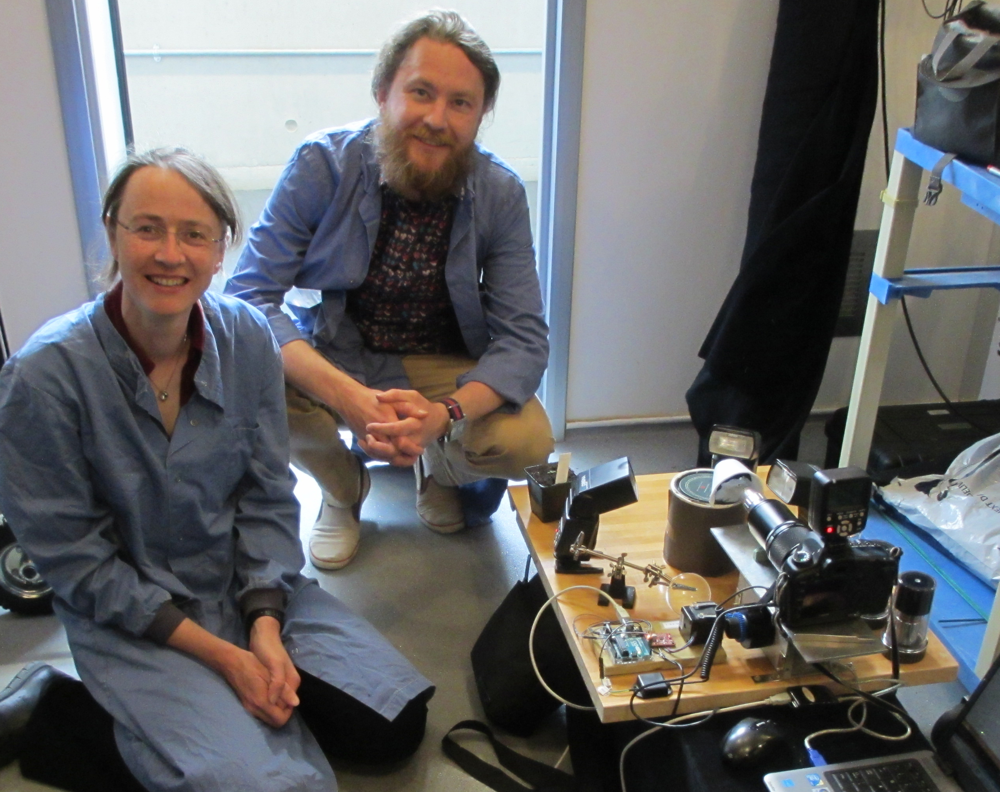

I visited Aleksandr Gavrin at the Sainsbury Laboratory in Cambridge, to photograph his Arabidopsis trichome mutant phenotype. This is us in their photographic room setting up the gear and taking some photos. 

## dis3-4 mutant leaves

## Wild type leaves

