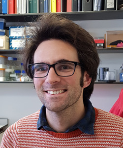
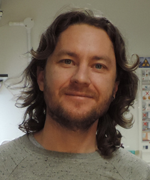

 
Jennifer Deegan 

 
Tim Deegan 

 
Richard Mortier 

 
Matthew Couchman 

 
Christopher Whitewoods 
 
Aleksandr Gavrin 

# Team

## Jennifer Deegan 

Visitor, Department of Plant Sciences, University of Cambridge. 

Designing, building and operating the setup. Writing the curriculum for knowledge transfer.  

## Richard Mortier 

Department of Computer Science and Technology, University of Cambridge. Sponsor for the research and cost centre. 

## Tim Deegan 

External collaborator in the computing industry. Technical advisor in home robotics, computer programming, electronics and optics. 

## Christopher Whitewoods 

Department of Cell and Developmental Biology, John Innes Centre, Norwich.  

Chris works on trap formation in the carnivorous plant Utricularia gibba, and is interested in the cellular basis of organ shape. He will provide plant material for Jennifer to grow and photograph.  

## Matthew Couchman 

Computational and Systems Biology, John Innes Centre, Norwich.  

Matthew Couchman is helping set up further collaborations.  

## Aleksandr Gavrin 

	Sainsbury Laboratory, University of Cambridge 

Alex works on mutant trichomes in Arabidopsis and so needs deep focus images of the trichomes at high magnification. He will provide photographic specimens for use with the microscope system.  

 
# Summary

Within the 6 month period of the grant, our aim is to design a £100 teaching tool and a curriculum to teach focus stacked photography to secondary school children and undergraduates.  

We will also extend our DIY professional-grade system so that it can photograph subjects from 0.25mm to 1cm and beyond. The system’s current range is 0.5mm to 2.5mm (See attached photos). This will enable capture of unique plant science images and will be a valuable teaching tool in its own right. This system will be fully documented so that it can be adapted and copied by other groups. 
Within and beyond the period of the grant, our aim is to use the system to take deep focus images of Arabidopsis trichomes, Utricularia gibba traps, and developing fern gametophytes.  

We hope that making these images available will start a trend for sharing of microscopic deep focus plant science images, and provide tools for school and University teaching staff to ignite enthusiasm for these tiny plant specimens. 
