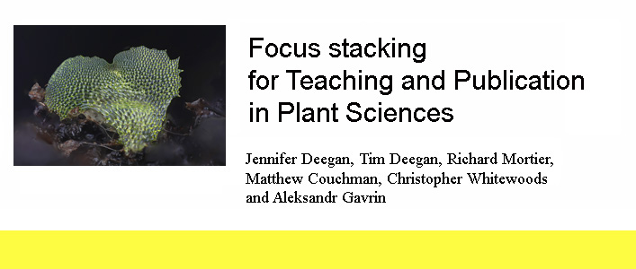

This project is the continuation of the <a href="https://github.com/BioMakers/23_Focus-stacking-system-for-gametophyte-ferns/blob/master/README.md">Fern Gametophyte Focus Stacking Project</a> funded by the Biomaker Challenge Grant of 2017.
The current project is funded by an OpenPlant Grant, and is again a collaboration between the University of Cambridge and the John Innes Centre. 

# Team

See our <a href="Team.md"> Team Page</a>

# Summary

Within the 6 month period of the grant, our aim is to design a £100 teaching tool and a curriculum to teach focus stacked photography to secondary school children and undergraduates.  

We will also extend our DIY professional-grade system so that it can photograph subjects from 0.25mm to 1cm and beyond. The system’s current range is 0.5mm to 2.5mm. This will enable capture of unique plant science images and will be a valuable teaching tool in its own right. This system will be fully documented so that it can be adapted and copied by other groups. 
Within and beyond the period of the grant, our aim is to use the system to take deep focus images of Arabidopsis trichomes, Utricularia gibba traps, and developing fern gametophytes.  

We hope that making these images available will start a trend for sharing of microscopic deep focus plant science images, and provide tools for school and University teaching staff to ignite enthusiasm for these tiny plant specimens. 

# Background

The 2017 Biomaker system is fully described on the <a href="https://github.com/BioMakers/23_Focus-stacking-system-for-gametophyte-ferns/blob/master/README.md">2017 Biomaker Focus stacking project write-up</a>.  

# Engineering changes since 2017 Biomaker Challenge

For engineering modifications during the 2018 OpenPlant Project 2018, see our <a href="Engineering.md"> Engineering Page</a>

# Results

See our <a href="Results.md"> Results Page</a>

# Cost of parts bought on the grant

See our <a href="CostOfParts.md"> Cost of Parts Page</a>

