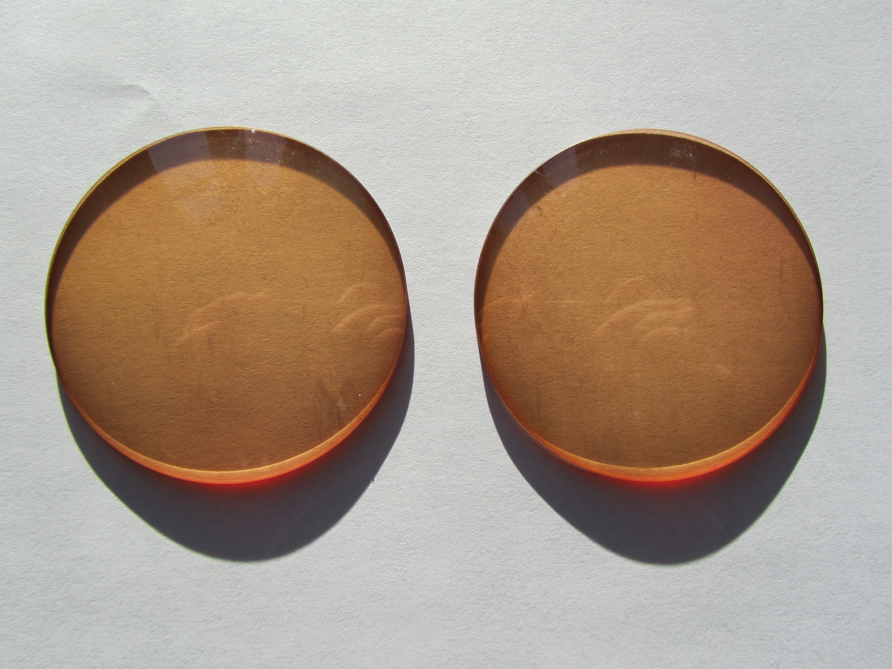

I recently visited Emeritus Professor Arnold Wilkins at his office in the Department of Psychology at the University of Essex. He has studied this problem extensively, and I read his <a href="https://theconversation.com/the-scientific-reason-you-dont-like-led-bulbs-and-the-simple-way-to-fix-them-81639"> article in the Conversation online</a>.

He explained to me that some people react badly to certain colours of light, and that different people react to different colours. He has designed a machine that shines light of different colours on a white page of printed text. He shows people the page and asks them which colour of light shining on the page makes it most comfortable to read. He can adjust the colour and saturation of the light as they are reading. 

He tested me and found that I experienced eye pain immediately on seeing the particular shade of blue like that is most prevalent in LED light blub light. Fishing around online for a picture of the light spectrum, I find <a href="https://i.stack.imgur.com/lkyXG.png"> this image</a> and it is the peak at 450nm that is causing me trouble. 

Conversely, Professor Wilkins found that my eyes were very comfortable looking at the page when it was lit with apricot coloured light. I found this very amusing because my whole house is painted this colour, and I have always been very comfortable reading the Financial Times which is printed on exactly that shade of newspaper. He very kindly sent me a pair of lenses in exactly this shade, and I just now very tentatively testing them on a new (old) CCFL apple cinema screen that I have bought from ebay. Here are the lenses:

Professor Wilkins also explained that the flicker of LEDs is also a problem. I knew this from reading online. He had a helpful tip though, than I wanted to pass on. The manufacturing industry is gradually improving LEDs, so that now some flicker and some do not. He says the easy way to test for flicker is to carry a fidget spinner and spin the spinner while looking through it at the source of LED light. He said that if we see a pattern on the spinner that is spinning in the opposite direction to the actual movement of the spinner, then that is a sign that the LEDs are flickering. 

